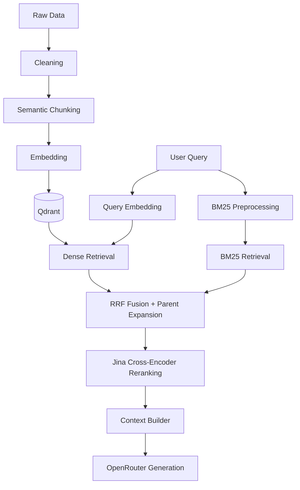

# persian-cultural-rag-agent

A step-by-step implementation of a RAG system for Persian cultural and historical content.

## Problem Statement

هدف پروژه ساخت یک سیستم RAG برای دسترسی ساده‌تر و دقیق‌تر به اطلاعات مربوط به بناها و محتوای تاریخی و فرهنگی ایران است.

## Architecture



## Chunking

The data is first divided into semantic units such as leads and sections.

Large units are split using a parent-child strategy, while smaller units are preserved.

```text
PAGE
 │
 └── Semantic Unit
        │
        ▼
      Parent
        │
        ▼
      Children
```

Current configuration:

```text
child_target_tokens  = 400
child_max_tokens     = 500
child_overlap_tokens = 40

parent_target_tokens = 900
parent_max_tokens    = 1200
```

Current dataset:

```text
pages          : 4,130
semantic_units : 13,809
parents        : 16,043
children       : 25,268
```

## Data Schema

The processed chunk file follows this structure:

```json
{
  "config": {},
  "stats": {},
  "parents": [
    {
      "parent_id": "...",
      "page_id": "...",
      "page_title": "...",
      "page_url": "...",
      "section_heading": "...",
      "text": "...",
      "tokens": 850
    }
  ],
  "children": [
    {
      "chunk_id": "...",
      "parent_id": "...",
      "page_id": "...",
      "page_title": "...",
      "page_url": "...",
      "section_heading": "...",
      "text": "...",
      "tokens": 380
    }
  ]
}
```

## Retrieval

Dense retrieval currently uses:

- Jina embeddings
- 1024-dimensional vectors
- Qdrant vector database
- Cosine similarity
- Configurable Top-K retrieval
- Scores, metadata, and source URLs

```text
Query
  ↓
Query Embedding
  ↓
Qdrant Search
  ↓
Top-K Children
  ↓
RetrievalResult
```

### Hybrid Retrieval (v0.2)

`hybrid_retriever.py` combines dense + BM25 with Reciprocal Rank Fusion (RRF, k=60),
fuses at the **parent level** (sibling children of one parent accumulate votes),
merges byte-identical duplicate chunks (SHA256 text fingerprint), and returns
parent texts (small-to-big).

```text
Query
  ├─→ Dense retrieval   → ranked list (2×K children)
  └─→ BM25 retrieval    → ranked list (2×K children)
            ↓
   Duplicate merge (identical text → canonical chunk_id)
            ↓
   Parent projection (children → parents)
            ↓
   RRF fusion at parent level
            ↓
     Top-K RetrievalResult (parent texts + child provenance)
```

Structured JSON logs are emitted per query (`retrieve.start`, `sparse.done`,
`dense.done`, `dedupe.done`, `retrieve.done`) with a shared `run_id`,
ready for later LangSmith ingestion.

Usage:

```powershell
# Full hybrid (Jina API + Qdrant required)
python -m src.retrieval.hybrid_retriever "query" --top-k 5

# BM25-only offline mode
python -m src.retrieval.hybrid_retriever "query" --no-dense --top-k 3

# Child-level fusion without parent expansion
python -m src.retrieval.hybrid_retriever "query" --no-parent-fusion

# DEBUG logging
python -m src.retrieval.hybrid_retriever "query" --verbose
```

### Reranking

Retrieval is fast but reads documents in isolation. Reranking is slower but reads
the query together with every candidate, producing a more precise final order.

`JinaReranker` uses the Jina Reranker API (`jina-reranker-v2-base-multilingual`)
to reorder hybrid candidates. The returned `score` is the cross-encoder
relevance score; the original dense/BM25/RRF score is preserved in
`metadata["retrieval_score"]`.

```text
Top-20 hybrid candidates
  ↓
Jina cross-encoder rerank
  ↓
Top-5 RetrievalResult (reranked)
```

## Generation

`RAGPipeline` (`src/rag/pipeline.py`) orchestrates the full flow:
retrieve → rerank → build context → generate.

- **Context builder**: numbered Persian blocks (page title, section heading,
  source URL, text), capped at `max_context_chars` (default 18,000).
- **Generator**: `OpenRouterGenerator` calls the OpenRouter chat completions
  endpoint with a grounded Persian system prompt — answer only from sources,
  cite claims like `[1]`, say explicitly when sources are insufficient.
- **Response**: `RAGResponse` with `answer`, ranked `Source` entries
  (chunk_id, page title, section heading, URL, score), model name, and token usage.
- **Tracing**: stage-level spans (`rag.pipeline`, `rag.retrieve`, `rag.rerank`,
  `rag.generate`) using OpenInference conventions, exported to
  [Arize Phoenix](https://arize.com/phoenix/). Content capture can be disabled
  via `PHOENIX_CAPTURE_CONTENT=0` for privacy-safe traces.

Configuration comes from `.env` via `RAGSettings.from_env()` (`src/rag/factory.py`),
which wires BM25 + dense + hybrid retrievers, reranker, and generator into a
single pipeline. Key variables: `OPENROUTER_API_KEY`, `OPENROUTER_MODEL`,
`JINA_API_KEY`, `QDRANT_URL`, plus optional tuning: `RAG_CANDIDATE_K` (20),
`RAG_FINAL_K` (5), `RAG_MAX_CONTEXT_CHARS` (18000), `RAG_API_TIMEOUT` (120),
`PHOENIX_*` tracing settings.

Usage:

```powershell
# Run the full RAG pipeline end-to-end (Qdrant + Jina + OpenRouter required)
python -m src.rag.test
```

## Status

**v0.2-full-rag**

Completed in this release: data processing, chunking, embedding, vector storage,
dense retrieval, BM25 sparse retrieval, hybrid retrieval (RRF + parent expansion),
reranking, context building, OpenRouter grounded generation, Phoenix observability.

Next steps include retrieval evaluation, metadata filtering, dependency pinning,
tests, and packaging.