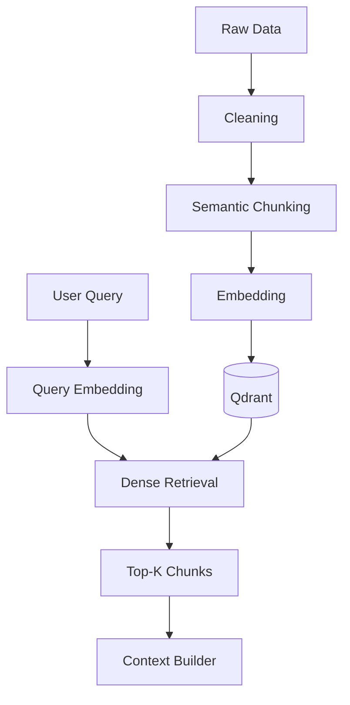

# persian-cultural-rag-agent

A step-by-step implementation of a RAG system for Persian cultural and historical content.

## Problem Statement

هدف پروژه ساخت یک سیستم RAG برای دسترسی ساده‌تر و دقیق‌تر به اطلاعات مربوط به بناها و محتوای تاریخی و فرهنگی ایران است.

## Architecture



## Chunking

The data is first divided into semantic units such as leads and sections.

Large units are split using a parent-child strategy, while smaller units are preserved.

```text
PAGE
 │
 └── Semantic Unit
        │
        ▼
      Parent
        │
        ▼
      Children
```

Current configuration:

```text
child_target_tokens  = 400
child_max_tokens     = 500
child_overlap_tokens = 40

parent_target_tokens = 900
parent_max_tokens    = 1200
```

Current dataset:

```text
pages          : 4,130
semantic_units : 13,809
parents        : 16,043
children       : 25,268
```

## Data Schema

The processed chunk file follows this structure:

```json
{
  "config": {},
  "stats": {},
  "parents": [
    {
      "parent_id": "...",
      "page_id": "...",
      "page_title": "...",
      "page_url": "...",
      "section_heading": "...",
      "text": "...",
      "tokens": 850
    }
  ],
  "children": [
    {
      "chunk_id": "...",
      "parent_id": "...",
      "page_id": "...",
      "page_title": "...",
      "page_url": "...",
      "section_heading": "...",
      "text": "...",
      "tokens": 380
    }
  ]
}
```

## Retrieval

Dense retrieval currently uses:

- Jina embeddings
- 1024-dimensional vectors
- Qdrant vector database
- Cosine similarity
- Configurable Top-K retrieval
- Scores, metadata, and source URLs
- Context construction for the next RAG stage

```text
Query
  ↓
Query Embedding
  ↓
Qdrant Search
  ↓
Top-K Children
  ↓
RetrievalResult
  ↓
ContextBuilder
```

## Status

**v0.1-rag-baseline**

Current focus: data processing, chunking, embedding, vector storage, dense retrieval, and context building.

Next steps include retrieval evaluation, hybrid search, reranking, and grounded generation.